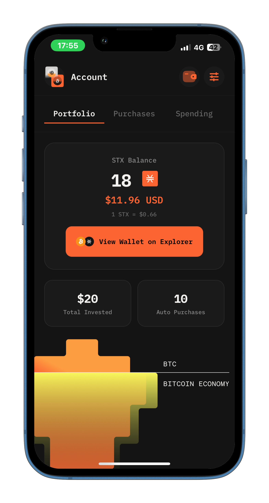

# StackLit | Spend to Stack

- Download via testflight: https://testflight.apple.com/join/8ZBdDZ2m

- **StackLit | Spend to Stack** is a seamless way to turn your everyday spending into automated STX savings. Without any sign-up or complicated setup, users instantly get a Stacks wallet, link their credit card, and set simple rules—like “when I spend 500 TL, add 5 STX to my wallet.” Every time a user spends, StackLit automatically invests according to their instructions, helping them grow their crypto holdings effortlessly while they shop.

- This project is a **mobile application** built with **React Native** and integrated with **blockchain via Clarity smart contracts**. It allows users to manage their investments, track STX token balances, and interact with smart contracts securely.

<video width="250" controls src="pitch-deck-video.mov" title="Title"></video>

---

## Features

- Track investments and portfolio performance
- View STX balances and transaction history
- Interact with blockchain smart contracts
- Import and manage wallets using Leather SDK
- Clean and intuitive mobile UI for iOS and Android

---

--- 
## Tech Stack

- **React Native**: Cross-platform mobile app
- **Clarity / Stacks**: Smart contracts for investment and token management

